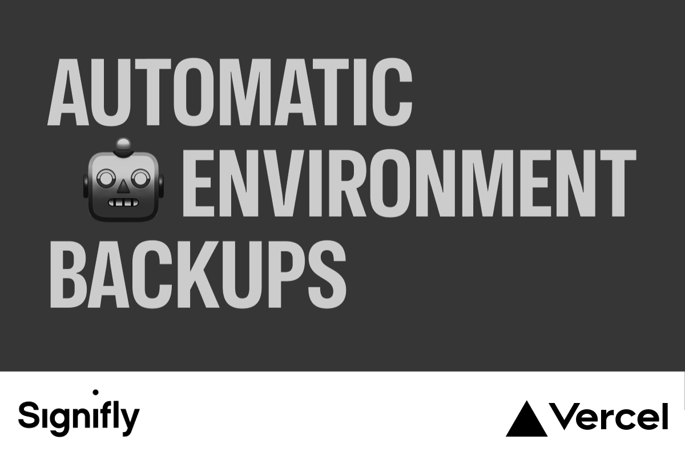

# Signifly DatoCMS Automatic Backups

A DatoCMS plugin by [Signifly](https://signifly.com) that automatically creates scheduled backups of your environments with full history tracking and configurable retention policies.

## Features

- **Scheduled Backups**: Daily, weekly, and monthly backup schedules with fully configurable cron expressions
- **Backup History**: Unlimited backup history stored in Vercel KV with status, duration, and timestamps
- **Manual Backups**: Trigger on-demand backups from the plugin UI
- **Retention Policies**: Automatically clean up old backups based on configurable retention counts
- **One-Click Deploy**: Deploy the backend service to Vercel with a single click

## Quick Start

### 1. Deploy the Backend to Vercel

[](https://vercel.com/new/clone?repository-url=https://github.com/signifly/datocms-plugin-signifly-backups&root-directory=apps/api&project-name=signifly-datocms-backups&env=CRON_SECRET&envDescription=A%20secret%20key%20for%20securing%20cron%20endpoints&stores=[{"type":"kv"}])

During deployment:
1. Set a secure `CRON_SECRET` (generate one with `openssl rand -hex 32`)
2. Vercel KV storage will be automatically provisioned

### 2. Install the Plugin

Install the plugin from the DatoCMS marketplace, or add it manually to your project.

### 3. Configure

1. When prompted, enter your Vercel deployment URL
2. Provide a DatoCMS Full-Access API token
3. Configure your backup schedules

## Architecture

This is a monorepo containing:

```
├── apps/
│   ├── plugin/     # DatoCMS plugin UI (React 19 + Vite)
│   └── api/        # Vercel API backend (Next.js 15)
├── packages/
│   └── shared/     # Shared TypeScript types
```

### Plugin (`apps/plugin`)

The DatoCMS plugin provides:
- Setup wizard for deploying and connecting the backend
- Backup history view with filtering
- Schedule configuration UI
- Manual backup trigger

### API Backend (`apps/api`)

The Vercel-hosted backend provides:
- `/api/cron/backup` - Scheduled backup execution (called by Vercel cron)
- `/api/backup/trigger` - Manual backup endpoint
- `/api/backup/history` - Backup history retrieval
- `/api/config` - Configuration management
- `/api/health` - Health check for connection validation

## Development

### Prerequisites

- Node.js 20+
- pnpm 9+

### Setup

```bash
# Install dependencies
pnpm install

# Start development servers
pnpm dev
```

This starts:
- Plugin dev server at `http://localhost:5173`
- API dev server at `http://localhost:3001`

### Build

```bash
pnpm build
```

### Type Check

```bash
pnpm typecheck
```

## Environment Variables

### API Backend (`apps/api`)

| Variable | Required | Description |
|----------|----------|-------------|
| `CRON_SECRET` | Yes | Secret for authenticating cron requests |
| `KV_*` | Auto | Vercel KV connection strings (auto-provisioned) |

## API Endpoints

### `GET /api/health`
Health check endpoint. Returns service status and KV connection state.

### `GET/PUT /api/config`
Manage backup configuration for a project.

### `POST /api/backup/trigger`
Trigger a manual backup. Requires `Authorization: Bearer <apiToken>` header.

### `GET /api/backup/history`
Retrieve paginated backup history. Supports filtering by type and status.

### `GET /api/cron/backup`
Cron endpoint called by Vercel. Requires `Authorization: Bearer <CRON_SECRET>` header.

## Extension Ideas

- **Backup Verification**: Verify environment accessibility after fork
- **One-Click Restore**: Promote backup environment to primary
- **Notifications**: Slack/Discord webhooks for backup events
- **Multi-Environment**: Backup from any environment, not just main
- **Backup Tags**: Tag and pin important backups
- **Analytics Dashboard**: Success rates, duration trends

## About Signifly

[Signifly](https://signifly.com) is a digital agency specializing in strategy, design, and technology. We build digital products and experiences that make a difference.

## License

MIT
